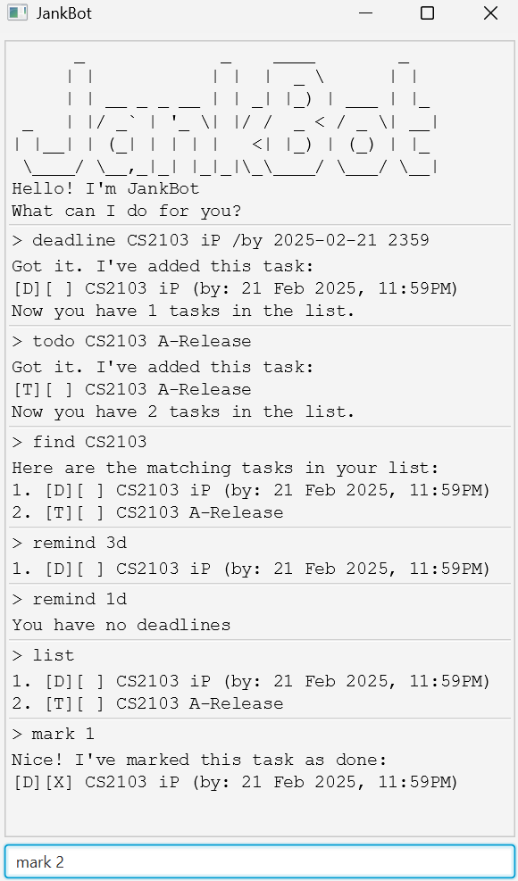

# JankBot User Guide

Jankbot manages tasks and ensures data is saved automatically after any updates.
It provides an easy way to stay organized with minimal effort.

## Adding a deadline: `deadline`

Adds a task with a deadline.

Format: `deadline DESC /by DEADLINE`

- Creates a task with a deadline with the description of `DESC`.
- `DEADLINE` has the format of `yyyy-MM-dd HHmm`.

Example:

- `deadline cs2103 /by 2025-02-21 1000`

## Adding a todo: `todo`

Adds a task with a description only.

Format: `todo DESC`

- Creates a task with the description of `DESC`.

Example:

- `todo cs2103`

## Adding an event: `event`

Adds a task with a specified start and end date-time.

Format: `event DESC /from START /to END`

- Creates a task with a start and end date-time  with the description of `DESC`.
- `START` and `END` has the format of `yyyy-MM-dd HHmm`.

Example:

- `event cs2103 /from 2025-02-19 2000 /to 2025-02-20 2100`

## Reminding deadlines: `remind`

Reminds about deadlines that will be due soon

Format: `remind DURATION`

- `DURATION` consists of a number followed by one or more time units,
  specifying the time period for the reminder.
  The valid time units are:
  - `d` for days
  - `h` for hours
  - `m` for minutes
  - `s` for seconds

Example:

- `remind 1d`
- `remind 1d 1h`
- `remind 1h 1m 5s`

## Listing all tasks: `list`

Lists all tasks.

Format: `list`

## Finding for task: `find`

Finds the tasks that contains the specified query.

Format: `find QUERY`

- `QUERY` is the string to find in the description of the tasks.

Example:

- `find cs2103`

## Sorting the tasks: `sort`

Sorts the tasks in ascending order from most recent to least recent.
Deadlines are sorted by due date,
events are sorted by end date,
and todos are placed at the bottom.

Format: `sort`

## Deleting a task: `delete`

Deletes a task.

Format: `delete INDEX`

- Deletes the task at the specified `INDEX`.
  `INDEX` **must be** a positive integer.

## Marking a task: `mark`

Marks a task.

Format: `mark INDEX`

- Marks the task at the specified `INDEX`.
  `INDEX` **must be** a positive integer.

## Unmarking a task: `unmark`

Unmarks a task.

Format: `unmark INDEX`

- Unmarks the task at the specified `INDEX`.
  `INDEX` **must be** a positive integer.

## Exiting the program: `bye`

Exits the program

Format: `bye`

## Saving the data

JankBot's data are saved in the hard disk automatically after any command
that changes the data.
There is no need to save manually.

# Command summary

| **Action**               | **Format, Examples**                                                                 |
|--------------------------|--------------------------------------------------------------------------------------|
| **Add a deadline**        | `deadline DESC /by DEADLINE` **e.g.,** `deadline cs2103 /by 2025-02-21 1000`        |
| **Add a todo**            | `todo DESC` **e.g.,** `todo cs2103`                                                |
| **Add an event**          | `event DESC /from START /to END` **e.g.,** `event cs2103 /from 2025-02-19 2000 /to 2025-02-20 2100` |
| **Remind about deadlines**| `remind DURATION` **e.g.,** `remind 1d`, `remind 1d 1h`, `remind 1h 1m 5s`        |
| **List all tasks**        | `list` **e.g.,** `list`                                                             |
| **Find a task**           | `find QUERY` **e.g.,** `find cs2103`                                               |
| **Sort tasks**            | `sort` **e.g.,** `sort`                                                             |
| **Delete a task**         | `delete INDEX` **e.g.,** `delete 2`                                                 |
| **Mark a task**           | `mark INDEX` **e.g.,** `mark 3`                                                    |
| **Unmark a task**         | `unmark INDEX` **e.g.,** `unmark 3`                                                |
| **Exit the program**      | `bye` **e.g.,** `bye`                                                              |

